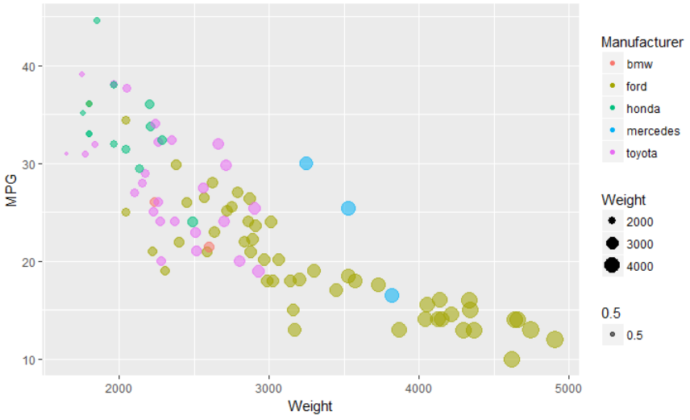
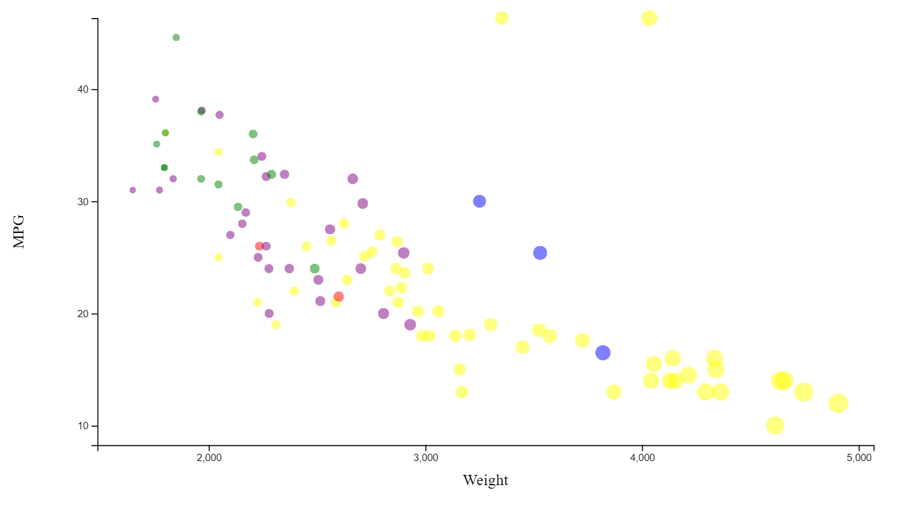
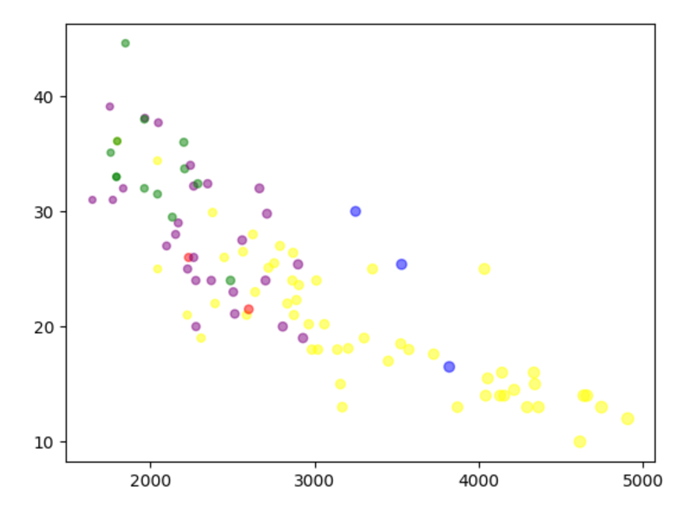
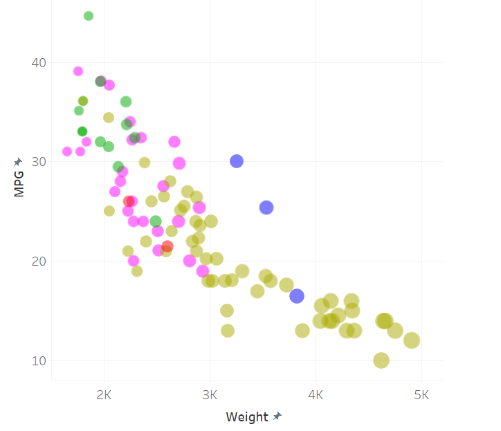
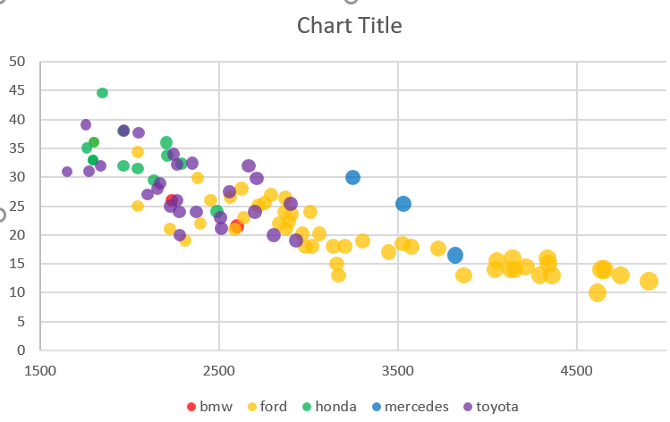
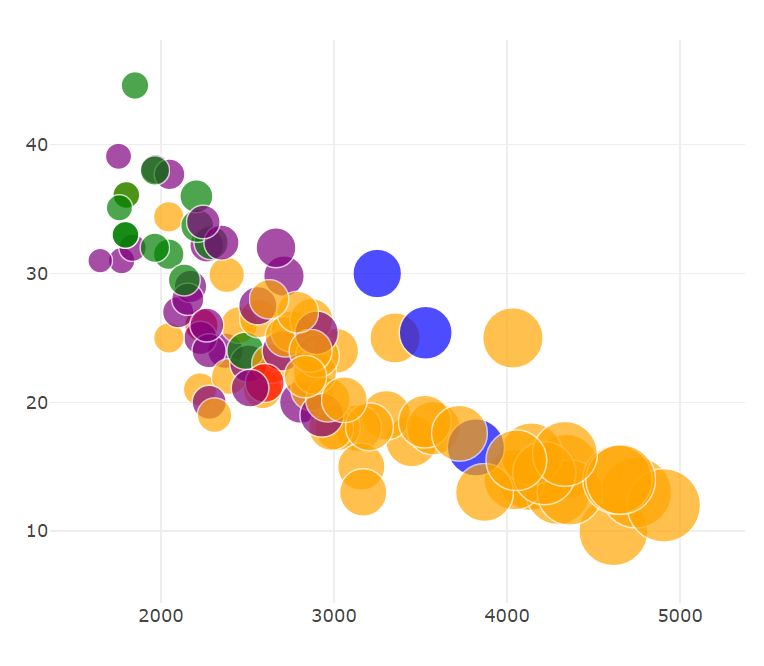
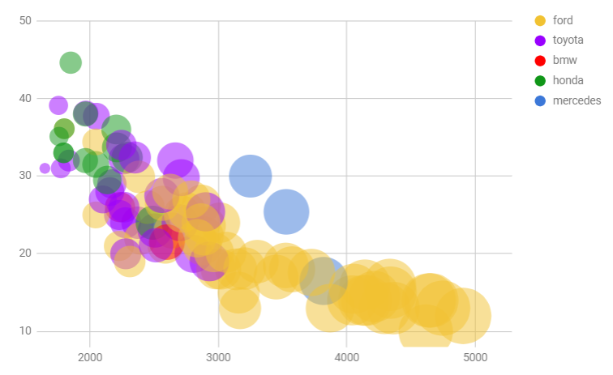
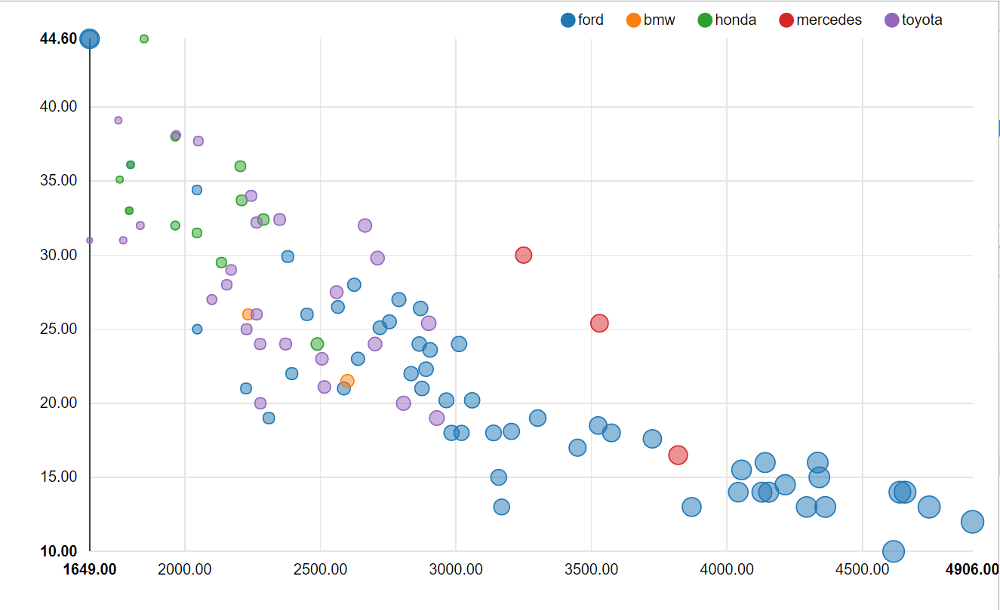
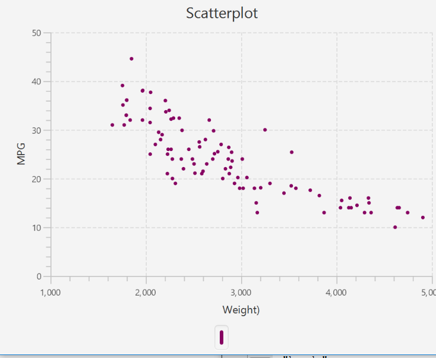
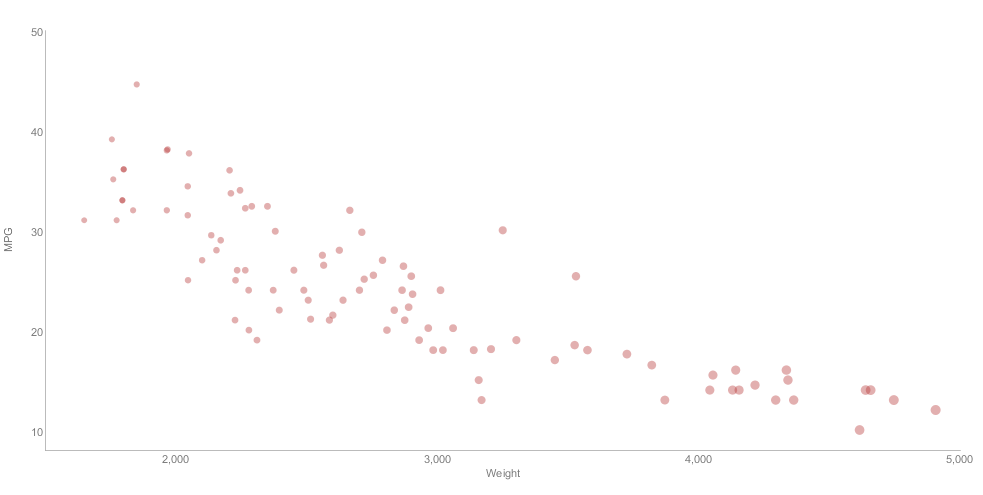

# 02-DataVis-10ways

Assignment 2 - Data Visualization, 10 Ways  
===

# R + ggplot2

Using ggplot2 with R within RStudio was very straightforward after Lane did a similar demo in class.
I found it interesting how setting the size and colour within the geom_point function
automatically scaled to the size of the data. I was very surprised to just type one line of code and see the
exact chart laid out in the example appear.

# d3

Recreating this scatterplot using d3 was relatively straightforward with the
help of bl.ocks.org but still posed a couple smaller obstacles. Initially the data was not showing up
because I was attempting to append to the svg inside the d3.csv function which was creating an empty
visualization due to it's asynchronous nature. Moving the code out into it's own function solved this. Additionally, some of
the circles of the scatterplot were initially right on top of the axes. In order to give some space/padding, I added a calculated cushion
onto both sides of the x and y range so that all the circles were a set distance away from the x and y axes. 

# python + matplotlib

This was definitely the hardest visualization to recreate so far in the project. First off, loading the data
was a bit harder upfront because it required essentially reading the csv into a 2d array then taking out columns
of data using python array operations. What further confused me was numpy arrays. Specifying a different color for each point
was much more difficult than in ggplot2 where the geom_point function automatically assigned colors to categorical data or d3 where
a color attribute was accessible through a javascript object mapping during plotting. Matplotlib and numpy required assembling a whole new array of
correponding colors to pass into the scatter() function. I felt the urge to be able to see in code each iteration behind this function. I also had trouble getting the tick marks in the desired locations. Similarly to using the extent(min,max)
function in d3/js to find the range of the data at hand, I was using the numpy.arange() function in python. I couldn't figure out how to shift the returned tick values
to the nearest 1000 so just manually added the offset.

# tableau

Using tableau provided a very seamless, easy to use interface for visualizing this scatterplot. My favorite feature was just
being able to drag and drop the weight measure and manufacturer dimension over the size and color boxes in the marks area. Adjusting axes
was also very simple as well. Tableau also identified null values and prompted the option to remove them from the dataset.

# excel

Excel was surprisingly difficult to use to create this chart at first. I spent a decent amount
of time looking into VBA subroutines with scatter charts before realizing a bubble chart would do the trick.
Even after figuring this out, a lot of spreadsheet manipulation was necessary - pulling out the weight, MPG, and
manufacturer columns. I thought it was slightly counterintuitive the way the tutorial I found had the spreadsheet set up - splitting up each
categorical item into its own column. Having said this, I am no excel expert, the documentation is robust, and it took significantly less time than
the matplotlib solution.

# python + plotly

After using matplotlib with python, ploty was extremely easy to use. I could re-use almost
all set up code reading the csv file into numpy arrays for each of the weight, mpg, and manufacturer
attributes. I thought the documentation for plotly was better and gave a much more simple way to adjust
axes attributes with settings like tick0, dtick, etc. I couldn't figure this out without hard coding in matplotlib
but in plotly it took a couple minutes. The support for online plotting was also really cool.

# google sheets

Google sheets was significantly easier to use than excel for this visualization. It's axes immediately 
adapted to the dataset and the chart customization was much more user friendly in terms of choosing which data
set was represented as x-axis, y-axis, or bubble size. It also didn't require much spreadsheet manipulation - I just selected
the four columns with relevant data and could do the customization afterwards. One drawback is it didn't allow
for scaling of the bubble size as excel did - which led to the chart being harder to read to the right where
the bubble sizes are all closer to the max size (sizes them based off the range of the dataset).

# nvd3

Using nvd3 was relatively straightforward after using d3. Nvd3 is built with d3 v3 however, so the d3 aspects are slightly different.
It took me a while to format the data correctly to feed it into the d3.datum() function. Nvd3 doesn't have robust documentation or APIs yet so
that blocked me into having trouble breaking out of the example I started with for features such as color and axes range/padding/tick marks.

# javafx

Working with javafx was one of the harder tools. I struggled to adjust colors and sizes
from the java code due to the interfacing with css. I'm familar with java so the setup was simple.

# processing

After struggling with javafx, Processing with the help of the gicentre charting library was a 
breath of fresh air. Similar to google sheets and a couple other tools above, setting axis ranges was very simple, and
the setPointColor and setPointSize functions had versions allowing for correponding arrays similar to the python numpy setups.

## Technical Achievements
My main technical achievement is the variety of languages used vs just UI tools. I used two
python libraries, two javascript libraries, and two java libraries whereas the requirement was only 3.

Additionally, I incorporated interactivity into a few of the visualizations including nvd3 where
it is possible to turn off a categorical grouping of points by clicking the legend in the top corner. This is
shown here:
https://bwolfson978.github.io/02-DataVis-10ways/index.html

### Design Achievements
My design achievements primarily include color choices and aesthetics especially in the d3/nvd3 visualizations.
I used the d3 colorscale in the nvd3 visualization which allowed the colors to fit more smoothly with each other.

Additionally, most of my visualizations have legends corresponding to the color choices.

## Sources
http://learnjsdata.com/read_data.html
https://bl.ocks.org/d3noob/6f082f0e3b820b6bf68b78f2f7786084
http://www.d3noob.org/2016/08/changing-number-of-ticks-on-axis-in.html
http://bl.ocks.org/jfreels/6812882
https://bl.ocks.org/d3noob/23e42c8f67210ac6c678db2cd07a747e
http://www.r-tutor.com/r-introduction/data-frame/data-import
http://www.cookbook-r.com/Graphs/Scatterplots_(ggplot2)/
https://pythonprogramming.net/reading-csv-files-python-3/
https://plot.ly/matplotlib/scatter/#basic-matplotlib-scatter-plot
https://stackoverflow.com/questions/12236566/setting-different-color-for-each-series-in-scatter-plot-on-matplotlib
http://onlinehelp.tableau.com/current/pro/desktop/en-us/viewparts_marks_markproperties_color.html
https://www.thedataschool.co.uk/borja-leiva/creating-scatter-plots-tableau/
https://www.myexcelonline.com/blog/bubble-chart-3-variables-on-a-chart/
https://www.extendoffice.com/documents/excel/2347-excel-bubble-chart-color-based-on-value.html
https://plot.ly/python/line-and-scatter/
https://plot.ly/python/reference/#layout-xaxis-tickmode
https://plot.ly/python/axes/#set-and-style-axes-title-labels-and-ticks
https://productforums.google.com/forum/#!topic/docs/LZqnQng8NwA;context-place=topicsearchin/docs/category$3Awindows
https://github.com/nvd3-community/nvd3/blob/gh-pages/examples/scatterChart.html
http://nvd3.org/index.html
https://www.mkyong.com/java/how-to-read-and-parse-csv-file-in-java/
https://gist.github.com/jewelsea/5094893
https://docs.oracle.com/javafx/2/charts/scatter-chart.htm
http://gicentre.org/utils/reference/org/gicentre/utils/stat/XYChart.html#setPointColour-float:A-org.gicentre.utils.colour.ColourTable-
https://www.gicentre.net/utils/chart/